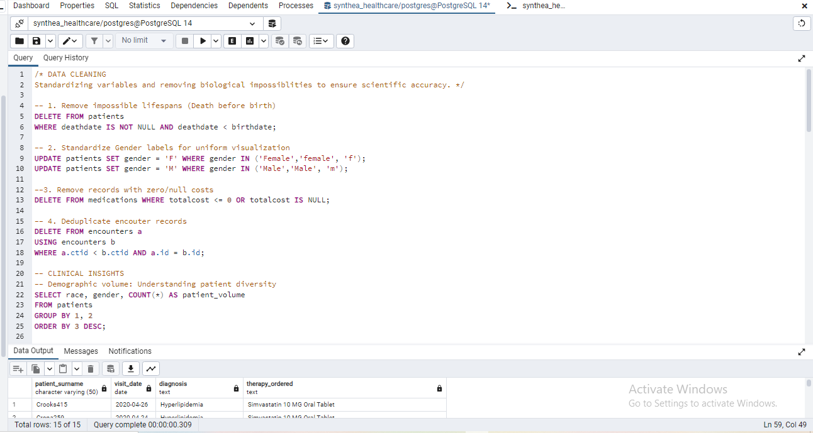
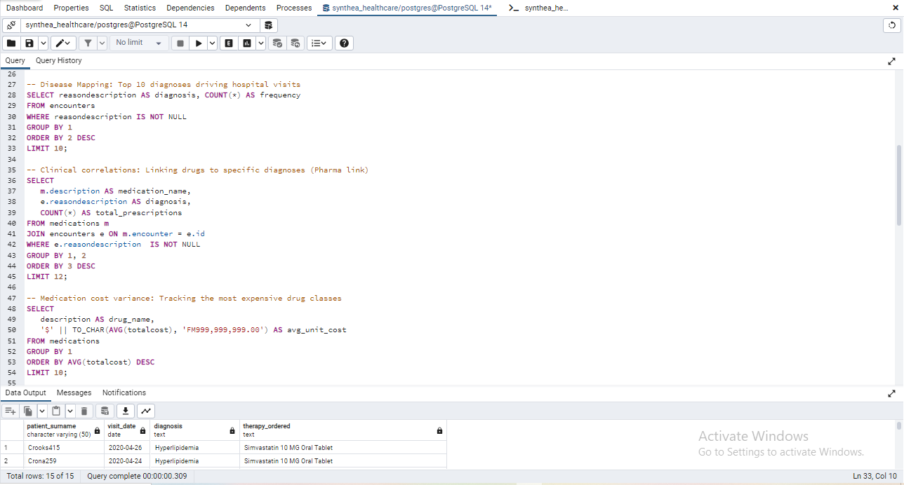
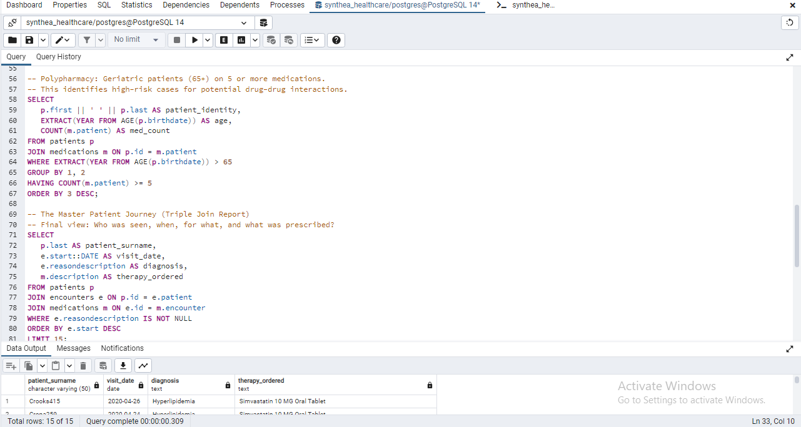

# Clinical Data Audit & Pharmacological Risk Analysis

## Project Overview

Medication-related harm remains a significant challenge in healthcare, particularly among patients receiving multiple medications. This project uses SQL to analyze electronic health records, identify medication-related risks, and generate actionable clinical insights that support safer prescribing and improved patient care.

## Business Problem

Healthcare providers generate large volumes of clinical data every day. Extracting meaningful insights from this data is essential for identifying high-risk patients, understanding prescribing patterns, and supporting evidence-based clinical decision-making. This project demonstrates how SQL can be used to transform raw healthcare data into actionable intelligence.

## Project Objectives

- Clean and prepare clinical datasets for analysis.
- Explore patient treatment pathways.
- Identify patients at risk of polypharmacy.
- Analyse diagnosis and medication relationships.
- Generate insights that support medication safety.

## Dataset

The project used synthetic electronic healthrecord data generated with **Synthea**.

From the extracted Synthea dataset, three CSV files were selected for analysis:

- **patients.csv** - patient identifiers and demographic information
- **medications.csv** - prescribed medications and treatment records
- **encounters.csv** - clinical visits, encounter dates, and diagnosis-related information

The three datasets were joined in PostgreSQL to reconstruct patient journeys, examine medication-diagnosis relationships, and identify elderly patients at risk of polypharmacy.

## Tools Used

- PostgreSQL
- pgAdmin
- SQL

## SQL Techniques Demonstrated

- INNER JOIN
- GROUP BY
- HAVING
- ORDER BY
- LIMIT

## Repository Structure

```text
clinical-data-audit/
│
├── data/
├── images/
├── results/
├── sql/
└── README.md
```

## Analysis Performed

This project includes SQL analyses covering:

- Data cleaning and preparation
- Patient journey analysis
- Polypharmacy identification
- Drug–diagnosis relationships
- Most frequently diagnosed conditions
- Most expensive medications
- Patient volume analysis

## Analysis Highlights

### Data Cleaning



### SQL Insights



### Polypharmacy & Patient Journey



## Key Insights

- Identified elderly patients receiving five or more medications who may require medication review.
- Reconstructed patient treatment journeys using SQL joins across multiple clinical tables.
- Explored relationships between diagnoses and prescribed medications.
- Produced analytical outputs that support medication safety and clinical decision-making.

## Business Value

This project demonstrates how SQL can transform complex healthcare datasets into actionable clinical intelligence. The analyses support medication safety initiatives, improve visibility into prescribing patterns, and provide insights that can assist healthcare professionals in making evidence-based decisions.

## Skills Demonstrated

- SQL
- PostgreSQL
- Clinical Data Analysis
- Data Cleaning
- Relational Databases
- Healthcare Analytics
- Data Storytelling

## Author

**Kanu Calista**

Healthcare Analytics • Business Analytics • Retail Analytics
